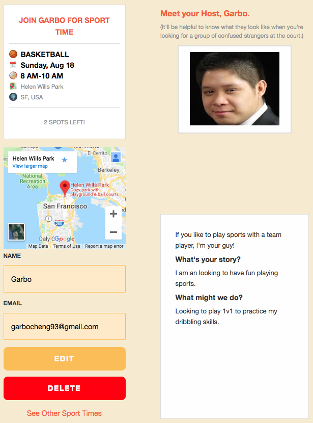
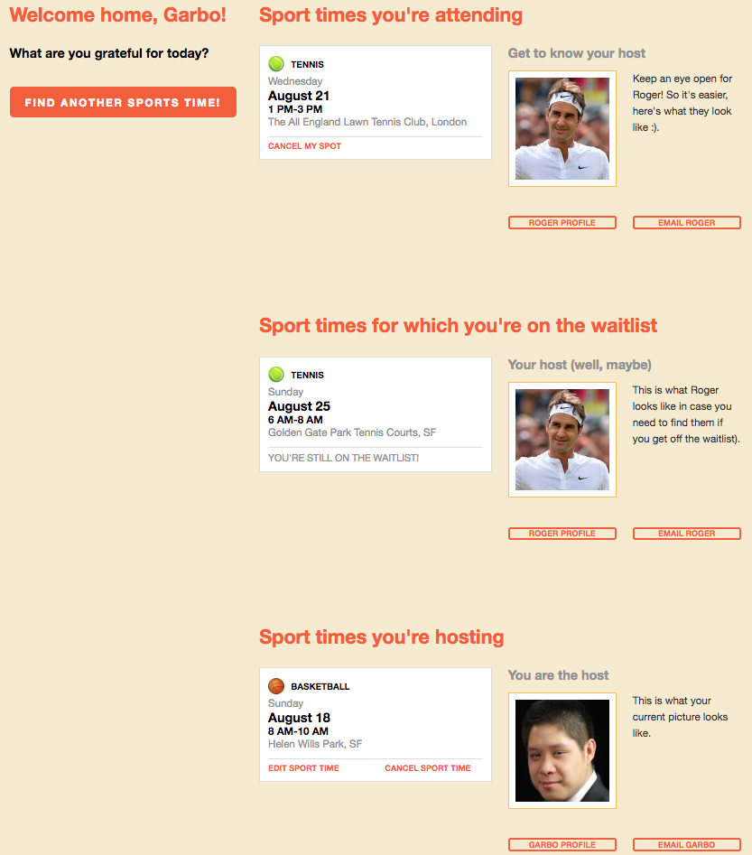
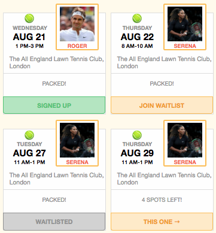

# Sports With Strangers


[Live Demo](https://exercise-with-strangers.herokuapp.com/#/)

SportsWithStrangers is a website that helps users find others to play sports with modeled after TeaWithStrangers. The website was built using Rails/PostgreSQL for the backend and React.js and Redux for the front end. It was built and designed within a two-week time period.

## Technologies used:
### Backend:
  * Ruby on rails version 5.2.1 to create a RESTful API
  * PostgreSQL for the databases

### Frontend:
  * React/Redux and Javascript for UI
  * React allowed the website to become more interactive by making the website just re-render parts of the website that changed as opposed to re-rending the whole page.

### More Technologies Used:
* AJAX
* JBuilder
* Node.js
* webpack
* BCrypt for user authentication
* Google Maps API to display location
* Babel for transpiling JSX into JavaScript.

## Features
* Hosted Events
  * Users can create, update, and delete their own sports events.



* Events
  * Users can join or waitlist on other users hosted events
  * Users can view all events and filter them by cities


* Dashboard
  * Users can view joined, hosted, or waitlisted events.
  * Users can cancel hosted events and cancel spot on joined events



 Since the joins table has a many to many relationship with both users and events, it was necessary to get the very specific id which indicates the event that a user has joined. Therefore, in order to accomplish this, I used a selector to not only filter the events that user has joined, but also added a joinId to the event object so that I can use this information to handle unjoining a user.

 ```js
 /* frontend/reducers/selectors.js */
 export const getJoinedEvents = ({events, currentUser, joinedEvents}) => {
   let result = [];

   for (let id in joinedEvents){
     let joinEvent = joinedEvents[id];

     for(let eventId in events) {
       if(joinEvent.event_id == eventId){
         let eventwithJoinEventId = Object.assign({}, events[eventId], {joinId: id});
         result.push(eventwithJoinEventId);
       }
     }
   }
   return result;
 };
```

In order to keep the code DRY, similar components were combined into one component. This was done for the displaying of the events in the dashboard.

``` js
<DashboardEventList
  type="joined"
  events={joinedEvents}
  cities={cities}
  categories={categories}
  currentUser= {currentUser}
  users={users}
  action={deleteJoinedEvent}/>

<DashboardEventList
  type="waitlist"
  events={waitlistedEvents}
  cities={cities}
  categories={categories}
  currentUser= {currentUser}
  users={users}
  action={deleteJoinedEvent}/>

<DashboardEventList
  type="hosting"
  events={hostedEvents}
  cities={cities}
  categories={categories}
  currentUser= {currentUser}
  users={users}
  action={deleteEvent}/>
```
Similarly, this was done to display all the events.

```js
eventsArr.forEach(event => {
  if (event.city_id === city.id) {
    cityIndex.push(
      <div>
        <EventIndexItem
          key={event.id}
          event={event}
          user={users[event.user_id]}
          city={city}
          categories={categories}
          currentUser = {currentUser}/>
      </div>
    );
  }
});
```


## Possible future Features

* Google Map API showing events based on location
* Suggestions based on event details
* Follow other users
